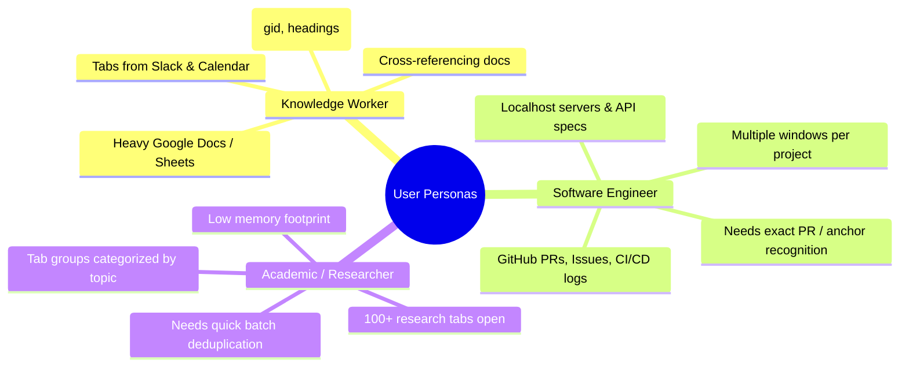
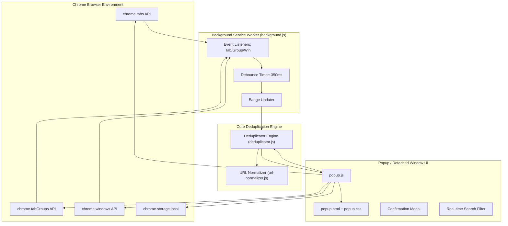

# Product Requirements Document (PRD)
## Smart Tab Deduplicator & Group Manager (Chrome Extension)

---

| Metadata | Details |
| :--- | :--- |
| **Product Name** | Smart Tab Deduplicator & Group Manager |
| **Document Version** | 1.0.0 |
| **Status** | Implemented / Active Production |
| **Platform** | Google Chrome Extension (Manifest V3) |
| **Target Audience** | Power browsers, knowledge workers, developers, researchers |
| **Repository** | [`tapverma/chrome-tab-deduplicator`](https://github.com/tapverma/chrome-tab-deduplicator) |

---

## 1. Executive Summary & Problem Statement

### 1.1 Problem Statement
Modern web workflows demand heavy multi-tab and multi-window usage. Users regularly accumulate 50–200+ active browser tabs across multiple windows and Chrome Tab Groups. Over the course of a workday, duplicate tabs inevitably spawn when opening links from chat applications (Slack, Google Chat), emails, calendar invites, or bookmarks.

This causes three critical friction points:
1. **Cognitive Overload & Lost Context**: Users waste minutes hunting for existing tabs or lose orientation across nested Chrome Tab Groups.
2. **Resource Exhaustion**: Redundant tabs consume hundreds of megabytes of RAM and battery power, slowing down machine responsiveness.
3. **Flaws in Existing Deduplication Tools**:
   - **Naive String Matching**: Legacy extensions compare raw URLs byte-for-byte (`url === url`), failing completely on Google Docs (`/edit` vs `/preview`), Google Sheets (`#gid=0` vs `#gid=987`), tracking parameters (`?utm_*`), and anchors.
   - **Loss of Tab Group Context**: Most tools treat tabs as flat lists, stripping away native Chrome Tab Group associations and color tags.
   - **Destructive "Close All" Actions**: Existing tools often bulk-close tabs without previewing or allowing granular single-tab control, resulting in lost work or accidental closure of active sessions.

### 1.2 Solution Overview
**Smart Tab Deduplicator & Group Manager** is a lightweight, privacy-first Manifest V3 Chrome extension that detects, groups, and cleans redundant tabs across all windows and tab groups. Powered by a specialized domain-aware normalization engine, it clusters duplicate tabs, displays native Chrome group colors and window context, and provides one-click navigation and selective cleanup.

---

## 2. Product Vision & Principles

### 2.1 Vision
To deliver a frictionless, zero-cognitive-overhead tab manager that keeps browser workspaces clean, saves system memory, and respects user context and privacy.

### 2.2 Guiding Principles
* **Context Preservation**: Never destroy organizational context. Always highlight which window and Chrome Tab Group a tab belongs to.
* **Smart Over Naive**: Understand web application semantics (Google Workspace, GitHub, YouTube) to catch duplicates that simple string matching misses.
* **Safety First**: Non-destructive by default. Always provide previews, explicit navigation, confirmation on bulk actions, and the ability to keep primary tabs.
* **Zero-Trust Privacy**: 100% on-device processing. No external telemetry, no remote servers, and minimal permissions.

---

## 3. User Personas



### Persona A: The Knowledge Worker (Product Manager / Analyst)
* **Behavior**: Opens 10–20 Google Docs, Sheets, and Slides every day from meetings, calendar invites, and Slack pings.
* **Pain Point**: Ends up with 5 tabs of the same spreadsheet on different sheet tabs (`gid`), cluttering the tab strip.
* **Goal**: Quickly consolidate duplicate documents while seeing which sheet tab each instance was looking at.

### Persona B: The Software Engineer
* **Behavior**: Uses multi-monitor setups with 3–5 browser windows, each housing separate Chrome Tab Groups for repositories, PR reviews, and monitoring dashboards.
* **Pain Point**: Opening GitHub links from notifications creates duplicate tabs across multiple windows.
* **Goal**: Jump directly to existing tabs across windows without having to search manually; close redundant tabs in-place.

### Persona C: The Tab Hoarder / Researcher
* **Behavior**: Maintains long-running browser sessions with 150+ tabs across grouped research topics.
* **Pain Point**: Chrome becomes sluggish; duplicate tabs waste gigabytes of system memory.
* **Goal**: Run a one-click "Clean All" to reclaim memory without disrupting grouped structures.

---

## 4. Key Features & Functional Requirements

### 4.1 Cross-Window & Tab Group Discovery
* **FR-1.1 (Multi-Window Scanning)**: Scan all open browser windows within the active Chrome profile simultaneously.
* **FR-1.2 (Window Differentiation)**: Tag every tab with a visual pill identifying its window (e.g., `[Current Win]`, `[Win 2]`, `[Win 3]`).
* **FR-1.3 (Tab Group Identification)**: Query `chrome.tabGroups` and enrich tab metadata with:
  * Tab Group Title (e.g., "Sprint 24", "Q3 Planning").
  * Native Chrome Color Dot (`blue`, `red`, `yellow`, `green`, `pink`, `purple`, `cyan`, `orange`, `grey`).
  * `[Ungrouped]` pill for tabs outside any group.

### 4.2 Smart URL Canonicalization Engine
* **FR-2.1 (Domain-Specific Canonicalization)**:
  * **Google Docs**: Normalize `/document/d/{id}/edit`, `/preview`, and `/view` into `https://docs.google.com/document/d/{id}`. Extract sub-details (e.g. `Heading: Summary`, `Tab: t.0`).
  * **Google Sheets**: Normalize `/spreadsheets/d/{id}/...` into `https://docs.google.com/spreadsheets/d/{id}`. Extract sheet GID and cell range into sub-detail pills (`Sheet gid: 0 • Range: A1:D10`).
  * **Google Slides**: Normalize `/presentation/d/{id}/...` into canonical presentation URL; display slide ID in sub-detail pill.
  * **Google Drive**: Normalize folder (`/folders/{id}`) and file (`/file/d/{id}`) URLs.
  * **GitHub**: Canonicalize pull requests (`/owner/repo/pull/{num}`) and issues (`/owner/repo/issues/{num}`) regardless of `/files`, `/commits`, or anchor comments. Display active sub-view in sub-detail pill.
  * **YouTube**: Canonicalize `youtube.com/watch?v={id}` and `youtu.be/{id}` while stripping playlist/queue params and retaining video timestamp (`Time: 120s`).
* **FR-2.2 (Universal Tracking Parameter Removal)**: Strip known tracking parameters (`utm_source`, `utm_medium`, `utm_campaign`, `utm_term`, `utm_content`, `fbclid`, `gclid`, `ref`, `source`, `si`, `usp`, `authuser`, etc.).
* **FR-2.3 (Structural Normalization)**: Remove redundant default ports (`:80`, `:443`), lowercase domain names, and strip trailing slashes for paths longer than `/`.

### 4.3 Mode Toggle: Smart Match vs. Exact Match
* **FR-3.1**: Provide a persistent toggle in the popup header allowing users to switch between **Smart Match** (default) and **Exact Match**.
* **FR-3.2**: In Exact Match mode, URLs are evaluated with strict string equality (outer whitespace trimmed), ensuring specialized developers can match exact query combinations when needed.
* **FR-3.3**: Persist user mode preference across browser sessions using `chrome.storage.local`.

### 4.4 Tab Navigation & In-Place Interaction
* **FR-4.1 (One-Click Tab Switch)**: Clicking any tab row in the popup:
  1. Automatically uncollapses the parent Chrome Tab Group if it is collapsed.
  2. Activates the target tab via `chrome.tabs.update(tabId, { active: true })`.
  3. Brings the target window to the foreground, unminimizing if minimized (`chrome.windows.update`).
  4. Closes the popup in toolbar mode to immediately reveal the selected tab.
* **FR-4.2 (Individual Tab Close)**: Provide a dedicated `×` button on each tab row that closes the specific tab in Chrome with an animated transition without triggering navigation.
* **FR-4.3 (Keep 1st Action)**: In each duplicate cluster header, provide a `Keep 1st` button to keep the primary tab (prioritizing grouped, active, or pinned tabs) and immediately close all remaining duplicates in that cluster.
* **FR-4.4 (Global Clean All)**: Provide a prominent "Clean All" button that identifies all redundant tabs across all clusters and batch-closes them.
* **FR-4.5 (Safety Confirmation Modal)**: Intercept "Clean All" clicks with a confirmation dialog stating the exact count of tabs that will be closed.

### 4.5 Persistent Detached Window Mode (Pop-Out)
* **FR-5.1**: Provide a pop-out button (`⧉`) in the toolbar popup header.
* **FR-5.2**: Spawns an independent floating popup window (`popup.html?detached=true`, 440×600px).
* **FR-5.3**: In detached mode, clicking a tab highlights the active row and shifts browser focus *without* closing the management window, allowing side-by-side multi-monitor tab triage.

### 4.6 Background Badge & Real-Time Synchronization
* **FR-6.1**: Background service worker monitors tab lifecycle events (`onCreated`, `onRemoved`, `onUpdated`, `onReplaced`), tab group events (`onCreated`, `onUpdated`, `onRemoved`), and window events (`onCreated`, `onRemoved`).
* **FR-6.2 (Debounced Processing)**: Debounce background evaluations by 350ms to prevent performance degradation during rapid tab opening/closing bursts.
* **FR-6.3 (Action Badge)**: Display an amber warning badge on the extension toolbar icon showing the current count of redundant duplicate tabs (hidden when 0).

### 4.7 Live Search & Filtering
* **FR-7.1**: Real-time search filter matching page title, domain, canonical URL, Chrome tab group name, and sub-detail pills.
* **FR-7.2**: One-click clear search button (`✕`) with dedicated empty states when no search results match.

---

## 5. Technical Architecture



### 5.1 Technology Stack
* **Architecture**: Manifest V3 (MV3) Chrome Extension.
* **Languages**: Vanilla JavaScript (ES6+ Modules), HTML5, CSS3.
* **State Management**: Reactive local state in popup controller + `chrome.storage.local` for user settings.
* **Test Suite**: Automated unit tests running with Node.js test runner covering normalization edge cases and clustering logic.

### 5.2 Key Data Models

#### `EnrichedTab`
```typescript
interface EnrichedTab {
  id: number;
  title: string;
  url: string;
  favIconUrl: string;
  windowId: number;
  windowName: string;         // e.g. "Current Win", "Win 2"
  isCurrentWindow: boolean;
  active: boolean;
  pinned: boolean;
  audible: boolean;
  groupId: number;            // -1 if ungrouped
  isGrouped: boolean;
  groupTitle: string | null;  // e.g. "Design Review", "Group #3"
  groupColor: string | null;  // "blue" | "red" | "yellow" | "green" | ...
  subDetail: string;          // e.g. "Sheet gid: 104 • Range: B2:C10"
}
```

#### `DuplicateCluster`
```typescript
interface DuplicateCluster {
  canonicalUrl: string;
  displayUrl: string;
  domain: string;
  title: string;
  tabs: EnrichedTab[];
}
```

---

## 6. Non-Functional Requirements (NFR)

### 6.1 Performance & Efficiency
* **Execution Latency**: Full deduplication scan of up to 500 open tabs across 5 windows must complete in `< 50ms`.
* **Memory Footprint**: Popup and background service worker memory consumption must remain below 15MB.
* **Debounced Event Handling**: Tab update listeners must not exceed 1 execution per 350ms window.

### 6.2 Security & Privacy
* **Zero Outbound Network Traffic**: The extension makes 0 HTTP/HTTPS or WebSocket requests. No telemetry, analytics, or remote logging.
* **Least Privilege Permissions**: Restricted strictly to:
  * `"tabs"`: Inspect URL, title, favicon, and manage tab state.
  * `"tabGroups"`: Read group title and color associations, uncollapse when navigating.
  * `"storage"`: Store user mode preference (`smart` vs `exact`).
* **Content Script Isolation**: No content scripts injected into user web pages. Zero exposure to page DOM or cookies.

### 6.3 Reliability & Edge Cases
* **Discarded/Frozen Tabs**: Correctly identify tabs discarded by Chrome Memory Saver without triggering unintended tab reloads.
* **Special Schemes**: Safely ignore or pass-through non-standard protocols (`chrome://`, `chrome-extension://`, `file://`).
* **Single Surviving Tab**: When closing tabs inside a cluster, if only 1 tab remains, dynamically collapse and remove the cluster from the UI with smooth animations.

---

## 7. Success Metrics & Key Performance Indicators (KPIs)

| Metric | Target | Description |
| :--- | :--- | :--- |
| **Deduplication Accuracy** | $> 99.5\%$ | Accurate clustering without false-positive grouping of distinct content. |
| **Scan Speed** | $< 50\text{ ms}$ | Time required to process and render 200 tabs. |
| **Tab Reclaim Rate** | Average 12–25% | Percentage of open tabs identified as redundant during typical user sessions. |
| **Crash / Error Rate** | $< 0.01\%$ | Runtime exceptions during tab closing or navigation. |
| **Privacy Compliance** | $100\%$ | Zero data transmitted outside the browser. |

---

## 8. Release & Deployment Plan

### Phase 1: MVP (Complete)
* [x] Core Manifest V3 structure and background event monitoring.
* [x] Smart URL normalization for Google Docs, Sheets, Slides, Drive, GitHub, and YouTube.
* [x] Chrome Tab Group badge integration with native colors.
* [x] In-place closing, "Keep 1st", and "Clean All" with confirmation modal.
* [x] Real-time toolbar badge counter.
* [x] Unit test suite passing (11 unit tests).
* [x] Detached pop-out window mode (`?detached=true`).
* [x] Open-source repository initialized on GitHub.

### Phase 2: Enhancements (v1.1)
* [ ] Domain exclusion whitelist (e.g. never suggest closing tabs from specific hosts).
* [ ] Keyboard shortcuts (e.g. `Cmd+Shift+D` to toggle popup).
* [ ] Estimated RAM savings badge (e.g. "~450 MB RAM reclaimed").
* [ ] Chrome Tab Group auto-consolidation (merge duplicate tabs into a dedicated review group).

### Phase 3: Advanced Automation (v2.0)
* [ ] Background auto-clean rule for exact duplicates exceeding a configurable idle duration (opt-in).
* [ ] Cross-device profile sync settings.
