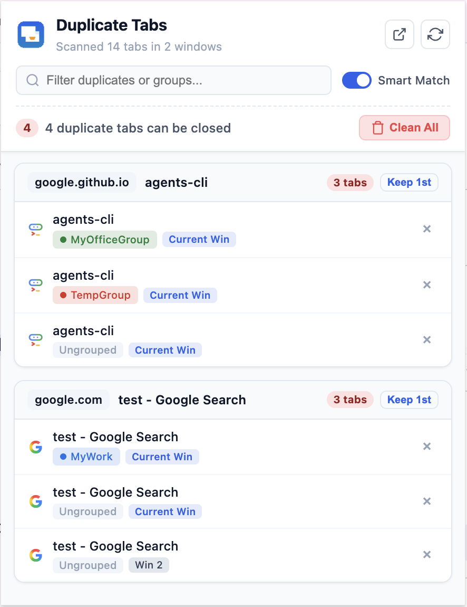

# Smart Tab Deduplicator & Group Manager (Chrome Extension)

A Manifest V3 Google Chrome extension designed for users with heavy tab usage, multiple windows, and tab groups. It identifies duplicate tabs across all windows and groups, uses smart URL canonicalization (for Google Docs, Google Sheets, tracking parameters, and hash fragments), displays native group color badges, and lets you close redundant tabs directly from the popup menu.



---

## Key Features

1. **Cross-Window Scanning**:
   - Discovers and lists tabs across all open Chrome windows in the active profile.
   - Shows window indicators (e.g. `[Current Win]`, `[Win 2]`).
   - Clicking any tab immediately focuses that tab and brings its window to the foreground.

2. **Tab Group Awareness**:
   - Identifies whether each tab belongs to a tab group or is ungrouped.
   - Displays a pill badge with the exact group name and Chrome's native group color dot (`blue`, `red`, `yellow`, `green`, `pink`, `purple`, `cyan`, `orange`, `grey`).
   - Displays `[Ungrouped]` for tabs outside groups.

3. **Smart URL Normalization (Google Docs, Sheets, and more)**:
   - **Google Docs**: Matches duplicate docs regardless of edit mode, view mode, section heading (`#heading=h.xyz`), or active tab parameter (`?tab=t.0`).
   - **Google Sheets**: Identifies duplicate spreadsheets even when viewing different sheets or cell ranges (e.g., `#gid=0` vs `#gid=1534012019&range=B5`). The specific sheet tab is clearly shown in a context pill (`Sheet gid: ...`).
   - **Google Slides & Forms**: Matches presentations and forms by ID across different slide views.
   - **GitHub & YouTube**: Matches pull requests (regardless of `/files` or comment anchors) and YouTube videos (stripping playlist and timestamp parameters).
   - **Tracking Parameters & Hashes**: Automatically cleans `utm_*`, `fbclid`, `gclid`, `ref`, and hash anchors (`#...`).
   - **Exact Match Toggle**: Switch between **Smart Match** and **Exact Match** mode directly from the popup header.

4. **In-Place Tab Closing & Deduplication**:
   - **Click Row (Preview without Closing)**: Clicking on a tab row activates that tab in Chrome and highlights it with an active blue border in the list, **without closing the popup** or shifting OS window focus.
   - **Jump to Tab (`↗`)**: Click the dedicated jump icon to bring that specific window and tab to the foreground.
   - **Individual Close (`×`)**: Click the cross button on any tab row to close that specific tab in Chrome instantly with smooth UI transitions.
   - **"Keep 1st" / "Keep This"**: One-click action to keep a preferred tab and close all other duplicates in that section.
   - **"Clean All"**: Batch closes all redundant duplicate tabs across all sections with a confirmation prompt.
   - **Side Panel (`◫`)**: Click the side panel icon in the header to open the deduplicator in Chrome's native persistent Side Panel. The side panel stays open permanently across all tab and window switches.
   - **Pop-out Window (`⧉`)**: Click to open as an independent compact floating window.
   - **Live Toolbar Badge**: Displays the current number of duplicate tabs open directly on the extension icon in Chrome's toolbar.

---

## How to Install and Load in Google Chrome

1. Open Google Chrome.
2. Navigate to `chrome://extensions/` in the address bar.
3. In the top-right corner of the Extensions page, enable **"Developer mode"** (toggle switch).
4. In the top-left corner, click the **"Load unpacked"** button.
5. Select this project directory:
   `/Users/tapanverma/Downloads/code/agy-chrome-dup-tabs`
6. The extension **"Smart Tab Deduplicator & Group Manager"** is now loaded!
7. Pin the extension to your Chrome toolbar by clicking the puzzle piece icon in the top right of Chrome and clicking the pin icon next to "Smart Tab Deduplicator".

---

## Project Structure

```
agy-chrome-dup-tabs/
├── manifest.json              # Chrome Extension Manifest V3 configuration
├── background.js              # Service worker managing real-time badge count
├── popup/
│   ├── popup.html             # Popup dropdown UI layout
│   ├── popup.css              # Clean Material 3 styling with light & dark modes
│   └── popup.js               # Event handling, tab switching, and closing
├── utils/
│   ├── url-normalizer.js      # URL canonicalizer for Google Docs, Sheets, UTMs, hashes
│   └── deduplicator.js        # Cross-window and tab group clustering engine
├── icons/                     # 16x16, 48x48, 128x128 icons and generator script
│   ├── icon-16.png
│   ├── icon-48.png
│   ├── icon-128.png
│   ├── icon.svg
│   └── generate_icons.js
├── test/
│   ├── normalizer.test.js     # Unit tests for URL normalizer
│   └── deduplicator.test.js   # Unit tests for clustering engine
├── CHROMEWEBSTORE.md          # Chrome Web Store listing & permissions guide
└── package.json               # Test script and dependencies
```

---

## Running the Automated Test Suite

Run the unit tests with Node:

```bash
npm test
```
